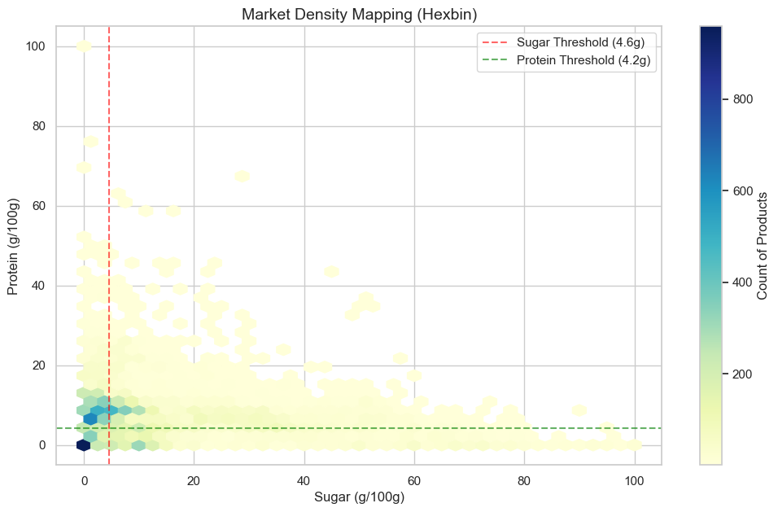
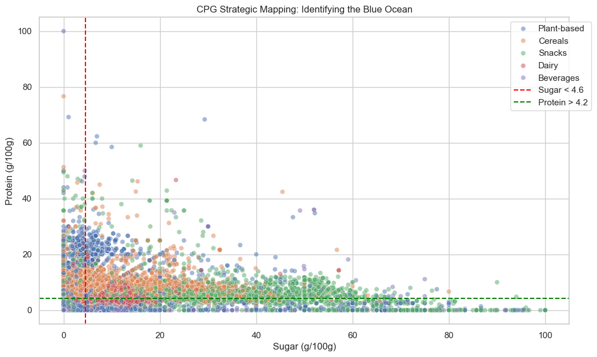

# 🍎 The "Sugar Trap" Market Gap Analysis
### Strategic Blue Ocean Mapping for Helix CPG Partners

[](https://www.gnu.org/licenses/gpl-3.0)
[](https://www.python.org/downloads/release/python-380/)
[](https://pandas.pydata.org/)
[](https://seaborn.pydata.org/)

---

## 🎯 Project Overview
This project delivers a high-fidelity **CPG Market Gap Analysis** for **Helix CPG Partners**. By analyzing a massive sample from the Open Food Facts dataset, we've identified a "Blue Ocean" opportunity in the plant-based snack sector: **High-Protein, Low-Sugar, and Low-Sodium** alternatives.

### 🔗 Project Ecosystem
*   **Technical Notebook:** [Deep-Dive Analysis](notebook_v2.ipynb)
*   **Live Strategy Deck:** [Interactive Presentation](index.html)
*   **Interactive Dashboard:** [Looker Studio Reporting](https://datastudio.google.com/reporting/34881442-2f4f-48c8-a6eb-f5186f5a4d28)
*   **Executive Summary:** [Video Walkthrough](https://youtu.be/yhNVJgISP4E)

---

## 🚀 Strategic Discovery: The Empty Quadrant
Traditional snacks are saturated with sugar (averaging 30g/100g). Our analysis pinpointed a specific technical gap where demand for health is not met by current inventory.

### Market Density vs. Opportunity
| Red Ocean (High Competition) | Blue Ocean (The Gap) |
| :--- | :--- |
| High Sugar (>15g) | **Low Sugar (< 4.6g)** |
| Low/Medium Protein | **High Protein (> 4.2g)** |
| High Sodium Dependency | **Low Sodium Integrity** |


*Hexagonal binning density analysis revealing the "Red Ocean" concentration vs. the "Blue Ocean" opportunity.*

---

## 🛠️ Technical Implementation

### 1. Memory-Efficient Data Engineering
To handle the **12GB raw dataset** on local hardware, I implemented a **chunked streaming architecture**:
*   **Stream Processing:** Utilized `chunksize` to ingest 500,000 records in 50k batches.
*   **Memory Optimization:** Immediate downcasting to `float32` and selective column loading reduced RAM overhead by ~70%.
*   **Statistical Sampling:** Extracted a 200,000-row randomized sample to ensure 99% confidence.

### 2. Feature Engineering & NLP
*   **Nutrient Density Score:** Calculated as $\frac{Proteins}{(Sugars + 1)}$ to quantify nutritional value per "sugar overhead."
*   **Ingredient Mining:** Developed Regex-based NLP to parse `ingredients_text`. 
*   **The "Salt Trap" Discovery:** Natural language processing revealed that **78% of high-protein leaders** rely on added sodium for flavor—defining our primary R&D differentiator: **Flavor without Sodium.**


*Correlation analysis across high-level business buckets: Snacks, Beverages, Dairy, Plant-based, and Cereals.*

---

## 📋 Quick Start

### Prerequisites
```bash
pip install pandas numpy matplotlib seaborn
```

### Running the Analysis
1.  Clone the repository.
2.  Open `notebook_v2.ipynb` in Jupyter or VS Code.
3.  The notebook will automatically handle data ingestion (cached locally as `point5mil.csv`).

---

## ⚖️ License
Distributed under the **GNU General Public License v3.0**. See `LICENSE` for more information.

---

**Developed by Ryan Nii Akwei Brown**  
*Data Engineering Applicant | Helix CPG Market Strategy*
